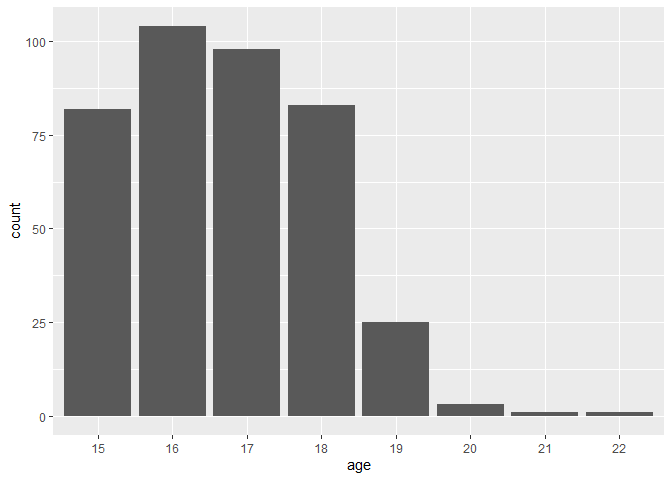
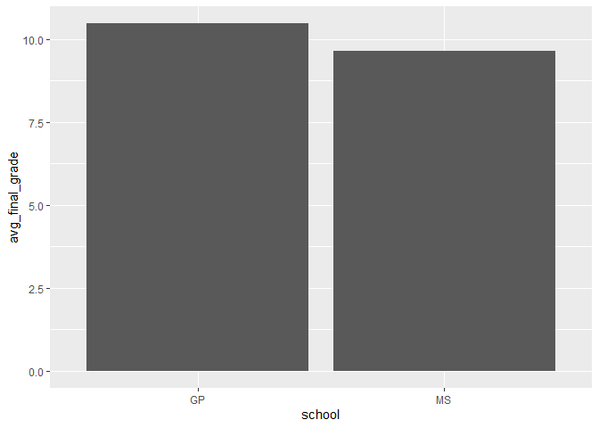

DS202: Final Project Summary 1
================
2022-11-01

``` r
library(ggplot2)
library(dplyr)
```

    ## 
    ## Attaching package: 'dplyr'

    ## The following objects are masked from 'package:stats':
    ## 
    ##     filter, lag

    ## The following objects are masked from 'package:base':
    ## 
    ##     intersect, setdiff, setequal, union

``` r
library("readxl")

data <- read_excel("C:\\Users\\dis90\\Downloads\\Copy of Maths.xlsx")

head(data)
```

    ## # A tibble: 6 × 33
    ##   school sex     age address famsize Pstatus  Medu  Fedu Mjob     Fjob    reason
    ##   <chr>  <chr> <dbl> <chr>   <chr>   <chr>   <dbl> <dbl> <chr>    <chr>   <chr> 
    ## 1 GP     F        18 U       GT3     A           4     4 at_home  teacher course
    ## 2 GP     F        17 U       GT3     T           1     1 at_home  other   course
    ## 3 GP     F        15 U       LE3     T           1     1 at_home  other   other 
    ## 4 GP     F        15 U       GT3     T           4     2 health   servic… home  
    ## 5 GP     F        16 U       GT3     T           3     3 other    other   home  
    ## 6 GP     M        16 U       LE3     T           4     3 services other   reput…
    ## # … with 22 more variables: guardian <chr>, traveltime <dbl>, studytime <dbl>,
    ## #   failures <dbl>, schoolsup <chr>, famsup <chr>, paid <chr>,
    ## #   activities <chr>, nursery <chr>, higher <chr>, internet <chr>,
    ## #   romantic <chr>, famrel <dbl>, freetime <dbl>, goout <dbl>, Dalc <dbl>,
    ## #   Walc <dbl>, health <dbl>, absences <dbl>, G1 <dbl>, G2 <dbl>, G3 <dbl>

This is a data set comprised of data collected from students attending
two different Portuguese secondary schools. In Portugal, the age of the
students in secondary schools roughly correspond to those of American
high schools, with students ranging from 15 to 18 years old. The data
set contains many variables which were collected in conjunction with the
target variable of semester grades, contained in the variables `G1`,
`G2`, and `G3`. These grades represent the students’ performance in
their Math classes.

``` r
summary(data)
```

    ##     school              sex                 age          address         
    ##  Length:397         Length:397         Min.   :15.00   Length:397        
    ##  Class :character   Class :character   1st Qu.:16.00   Class :character  
    ##  Mode  :character   Mode  :character   Median :17.00   Mode  :character  
    ##                                        Mean   :16.71                     
    ##                                        3rd Qu.:18.00                     
    ##                                        Max.   :22.00                     
    ##    famsize            Pstatus               Medu            Fedu      
    ##  Length:397         Length:397         Min.   :0.000   Min.   :0.000  
    ##  Class :character   Class :character   1st Qu.:2.000   1st Qu.:2.000  
    ##  Mode  :character   Mode  :character   Median :3.000   Median :2.000  
    ##                                        Mean   :2.748   Mean   :2.521  
    ##                                        3rd Qu.:4.000   3rd Qu.:3.000  
    ##                                        Max.   :4.000   Max.   :4.000  
    ##      Mjob               Fjob              reason            guardian        
    ##  Length:397         Length:397         Length:397         Length:397        
    ##  Class :character   Class :character   Class :character   Class :character  
    ##  Mode  :character   Mode  :character   Mode  :character   Mode  :character  
    ##                                                                             
    ##                                                                             
    ##                                                                             
    ##    traveltime      studytime        failures      schoolsup        
    ##  Min.   :1.000   Min.   :1.000   Min.   :0.000   Length:397        
    ##  1st Qu.:1.000   1st Qu.:1.000   1st Qu.:0.000   Class :character  
    ##  Median :1.000   Median :2.000   Median :0.000   Mode  :character  
    ##  Mean   :1.451   Mean   :2.033   Mean   :0.335                     
    ##  3rd Qu.:2.000   3rd Qu.:2.000   3rd Qu.:0.000                     
    ##  Max.   :4.000   Max.   :4.000   Max.   :3.000                     
    ##     famsup              paid            activities          nursery         
    ##  Length:397         Length:397         Length:397         Length:397        
    ##  Class :character   Class :character   Class :character   Class :character  
    ##  Mode  :character   Mode  :character   Mode  :character   Mode  :character  
    ##                                                                             
    ##                                                                             
    ##                                                                             
    ##     higher            internet           romantic             famrel     
    ##  Length:397         Length:397         Length:397         Min.   :1.000  
    ##  Class :character   Class :character   Class :character   1st Qu.:4.000  
    ##  Mode  :character   Mode  :character   Mode  :character   Median :4.000  
    ##                                                           Mean   :3.945  
    ##                                                           3rd Qu.:5.000  
    ##                                                           Max.   :5.000  
    ##     freetime         goout            Dalc            Walc          health     
    ##  Min.   :1.000   Min.   :1.000   Min.   :1.000   Min.   :1.00   Min.   :1.000  
    ##  1st Qu.:3.000   1st Qu.:2.000   1st Qu.:1.000   1st Qu.:1.00   1st Qu.:3.000  
    ##  Median :3.000   Median :3.000   Median :1.000   Median :2.00   Median :4.000  
    ##  Mean   :3.234   Mean   :3.108   Mean   :1.479   Mean   :2.29   Mean   :3.557  
    ##  3rd Qu.:4.000   3rd Qu.:4.000   3rd Qu.:2.000   3rd Qu.:3.00   3rd Qu.:5.000  
    ##  Max.   :5.000   Max.   :5.000   Max.   :5.000   Max.   :5.00   Max.   :5.000  
    ##     absences            G1              G2              G3       
    ##  Min.   : 0.000   Min.   : 3.00   Min.   : 0.00   Min.   : 0.00  
    ##  1st Qu.: 0.000   1st Qu.: 8.00   1st Qu.: 9.00   1st Qu.: 8.00  
    ##  Median : 4.000   Median :11.00   Median :11.00   Median :11.00  
    ##  Mean   : 5.695   Mean   :10.88   Mean   :10.69   Mean   :10.38  
    ##  3rd Qu.: 8.000   3rd Qu.:13.00   3rd Qu.:13.00   3rd Qu.:14.00  
    ##  Max.   :75.000   Max.   :19.00   Max.   :19.00   Max.   :20.00

``` r
dim(data)
```

    ## [1] 397  33

``` r
data$school <- as.factor(data$school)

data$sex <- as.factor(data$sex)

data$age <- as.factor(data$age)

data %>% 
  group_by(`school`) %>%
  summarize(n_students = n())
```

    ## # A tibble: 2 × 2
    ##   school n_students
    ##   <fct>       <int>
    ## 1 GP            350
    ## 2 MS             47

``` r
data %>% 
  group_by(`sex`) %>%
  summarize(n_sex = n())
```

    ## # A tibble: 2 × 2
    ##   sex   n_sex
    ##   <fct> <int>
    ## 1 F       209
    ## 2 M       188

``` r
data %>%
  group_by(`age`) %>%
  summarize(`n_age` = n())
```

    ## # A tibble: 8 × 2
    ##   age   n_age
    ##   <fct> <int>
    ## 1 15       82
    ## 2 16      104
    ## 3 17       98
    ## 4 18       83
    ## 5 19       25
    ## 6 20        3
    ## 7 21        1
    ## 8 22        1

There are 397 students listed in the data set. 350 of the students go to
the school “GP”, while only 47 of the students attend the school “MS”.
There are 209 females and 188 males.

``` r
data %>%
  ggplot(aes(`age`)) +
  geom_bar()
```

<!-- -->

``` r
data_avg <- data %>%
  group_by(`school`) %>%
  summarise(avg_final_grade = mean(`G3`))

data_avg %>%
  ggplot(aes(x = `school`, y = `avg_final_grade`)) +
  geom_bar(stat = "identity")
```

<!-- -->

It looks like the highest proportion of students are around 16 years
old. In terms of the highest average final grade, it appears as if “GP”
scored the highest.

Going forward, it will be necessary for us to convert some variables
into different types, as there are many variables classed as character
that would be more manageable as factors. Moreover, there is a
possibility that we can engineer new features based on what we have in
order to run interesting algorithms. Overall, there is a lot to work
with.

Note that the `echo = FALSE` parameter was added to the code chunk to
prevent printing of the R code that generated the plot.
